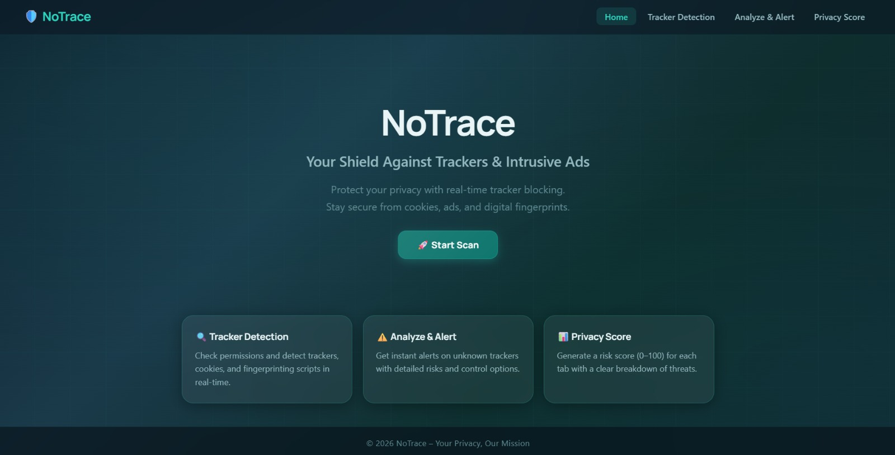
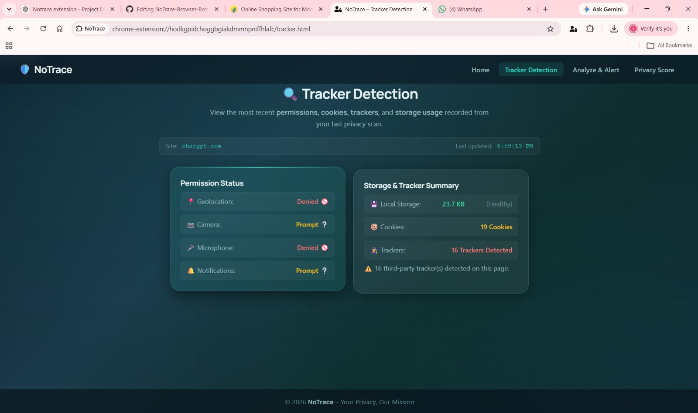
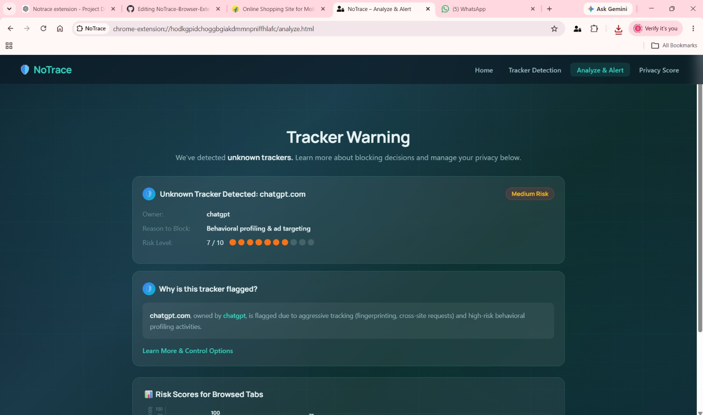
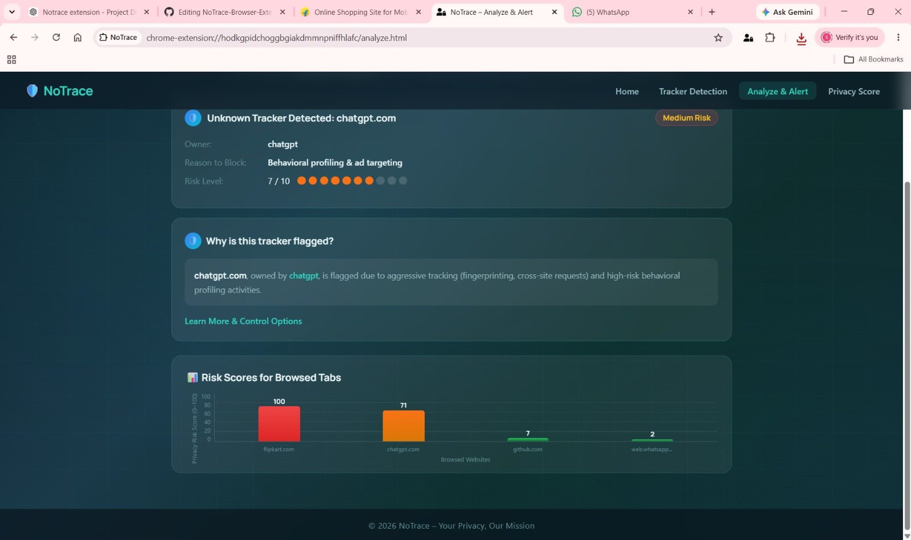
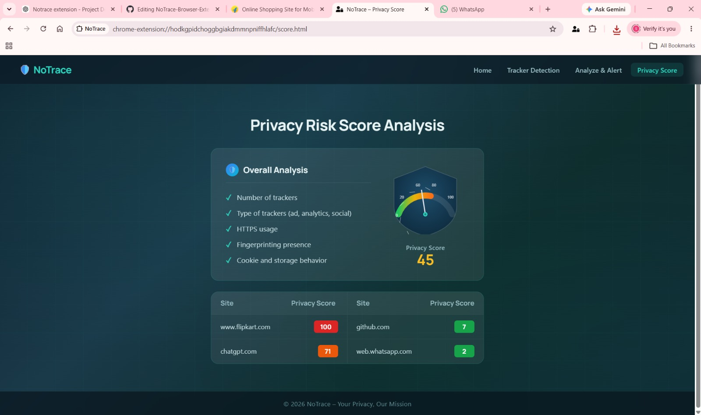

# NoTrace Browser Extension

A privacy-focused browser extension built using Manifest V3 that helps users detect trackers, monitor permissions, analyze cookies, evaluate storage usage, and generate privacy risk scores for websites.

## Features

- Multi-tab privacy scanning
- Tracker detection and analysis
- Cookie monitoring
- Permission status checking
- Local storage analysis
- Privacy risk score generation
- Analyze & Alert dashboard
- Interactive risk score visualization
- Real-time scan updates

## Technologies Used

- JavaScript
- HTML5
- CSS3
- Chrome Extension APIs
- Manifest V3

## Installation

1. Clone this repository
2. Open Chrome and navigate to:
   ```
   chrome://extensions
   ```
3. Enable **Developer Mode**
4. Click **Load Unpacked**
5. Select the NoTrace project folder

## Project Structure

- `background.js` – Scan management and risk score logic
- `content.js` – Website analysis and tracker detection
- `tracker.html` – Tracker Detection page
- `analyze.html` – Analyze & Alert dashboard
- `score.html` – Privacy Score page
- `manifest.json` – Extension configuration

## Future Enhancements

- Advanced privacy recommendations
- Enhanced risk score algorithm
- Chrome Web Store deployment
 ### Multi-Tab Scanning Demo

NoTrace scans and analyzes privacy risks across multiple open browser tabs.
## Screenshots

### Home Page


### Tracker Detection


### Analyze & Alert


### Risk Score Visualization


### Privacy Score


## Author

**Sushanthi S S**
